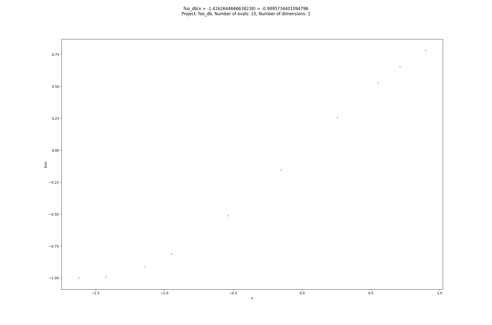
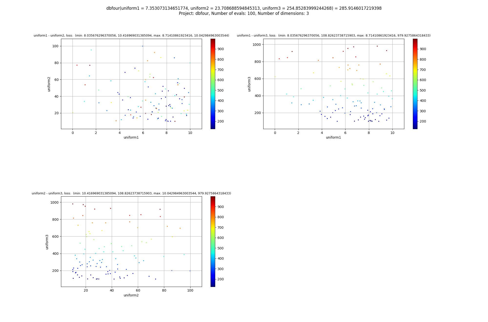

# Plotting the results of your optimization

## Requirements

You need to run your project with a MongoDB-instance and a MongoTrials-object.

Install these requirements:

```
pip3 install matplotlib pymongo
sudo apt-get install python3-tk
```

## Caveats

Currently, only a single `case` in the search-space is supported. Also, `hp.choice` is not supported
correctly, since in the database, the index of the chosen element will be saved, not the element
itself.

## How to run

```
python3 /path/to/hyperopt/plot.py --mongodbport=27017 --mongodbip=127.0.0.1 --project=dbfour
```

This will try to connect to the project `dbfour` on a running MongoDB-instance at localhost (127.0.0.1) at port 27017.

# What it does

This script plots the results of your optimization in 2 ways. If you only have one parameter, it will plot a single
2d-scatter plot, where the x-axis is your parameter and the y-axis is the loss.

If you have more than 2 parameters in your optimization, it will plot all combinations of them in 2d-scatter-plots,
where the color signifies the result (lower loss = blue, greater loss = red).

This way, you can easily check your parameter borders to see whether you need to increase them. If, for example,
all of the blue dots are on the right of a graph, you may increase the maximal number of points on that parameter-axis.

## Example

Singledimensional scatter plot:




Multidimensional scatter plot (3 parameters):


